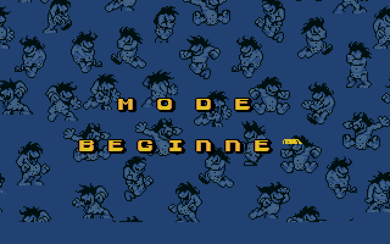
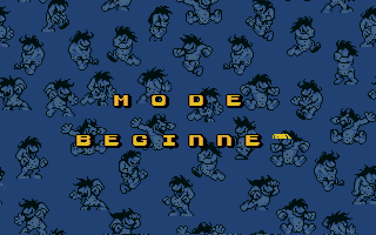

# Mode-select scrolling-background bug (visual)

The beginner/expert mode-select screen scrolls its background by **CRTC display-start panning +
page-flip double-buffering** (the `~1030:9600` present routine), *not* the gameplay scroll engine
(camera/ring/scroll-source are all zero here).

`display_start = (X/8 + Y·0x28) & 0x1FFF`, where `Y = [0xb19f]` is the scroll counter. The
`& 0x1FFF` (`and bh,0x1f`) means the screen treats the display as a **`0x2000`-byte (~205-row)
circular buffer** — the background is meant to **wrap** (repeat) at the page boundary.

**Bug:** only page 0 (`0x0`–`0x2000`) has the pattern + text; pages 1+ are empty. Our VM reads the
EGA display **linearly** past `0x2000` into the empty page, so the bottom goes blank and the text
scrolls off. The screen needs the scanline read to **wrap at `0x2000`**.

## The buffer (top → bottom)

The full plane buffer: the pattern + `MODE` / `BEGINNER` / `EXPERT` text fill rows 0–~205, then
it's empty. The 200-row display window pans down through this.

## With `0x2000` wrap (intended) vs linear (our VM)

Left = scanline read **wrapping at `0x2000`** (the bottom wraps to the pattern top → seamless
repeat, text stays). Right = **linear** read (our VM): blank bottom, text scrolling away.

| wrap at 0x2000 (intended) | linear (our VM — the bug) |
|---|---|
|  |  |

## Fix (applied)

`scripts/sdl_view.render_planar_rgb` now wraps the scanline read at `0x2000` for single-page
screens — detected by *display-start in page 0 AND no plane content beyond `0x2000`*. Verified
across all snapshots: only the 3 menu/title screens are flagged; every gameplay snapshot has
23k–45k bytes past `0x2000` (the scroll ring) so it keeps the full `0x10000` wrap, unchanged.

Result (the menu with the fix):

Open question: the "BEGINNER" **R** may still look off — its glyph in the font is *clean*, so if
it's wrong it's a draw-placement effect (the last char's `di & 0x1FFF` wrapping at the page edge,
same `0x2000` circular page). Check whether the R now reads correctly with the display wrap.
